2019/7/25

# webpack

## 一、基本安装

首先我们创建一个目录，初始化 npm，然后 在本地安装 webpack，接着安装 webpack-cli（此工具用于在命令行中运行 webpack）：

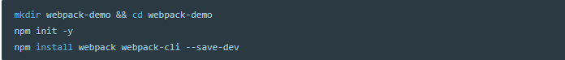

### project

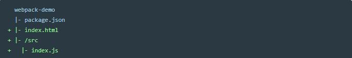

### src/index.js

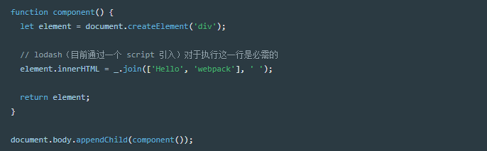

### index.html

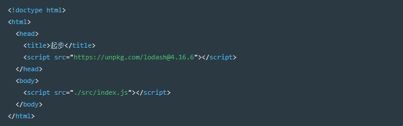

### package.json

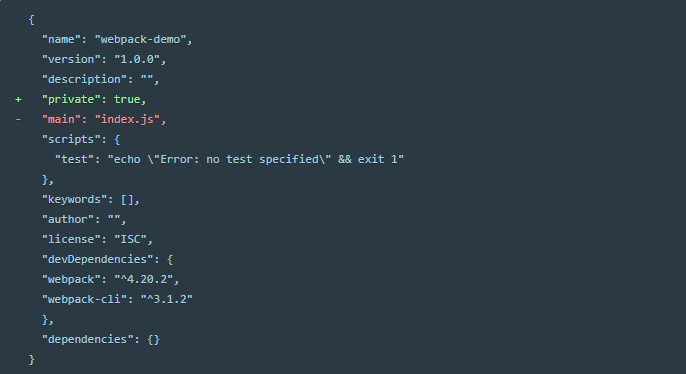

## 二、创建一个bundle

调整下目录结构，将“源”代码(/src)从我们的“分发”代码(/dist)中分离出来。源代码是用于书写和编辑的代码。分发代码是构建过程产生的代码最小化和优化后的 输出(output) 目录，最终将在浏览器中加载：

### project

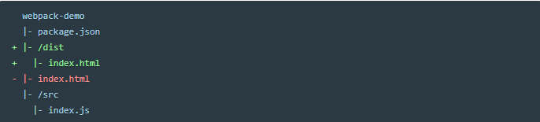

要在 index.js 中装入 lodash 依赖，我们需要在本地安装 library：

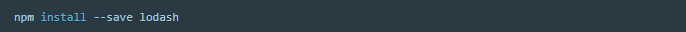

### src/index.js

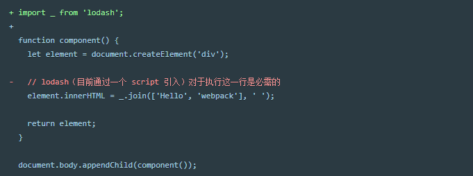

打包所有脚本，我们必须更新 index.html 文件。由于现在是通过 import 引入 lodash，所以要将 lodash script标签 删除，然后修改另一个 script 标签来加载 bundle，而不是原始的 /src 文件：

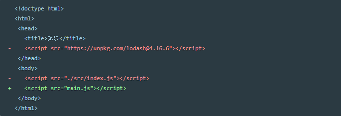

执行 npx webpack，会将我们的脚本 src/index.js 作为 入口起点，也会生成 dist/main.js 作为 输出。Node 8.2/npm 5.2.0 以上版本提供的 npx 命令，可以运行在开始安装的 webpack package 中的 webpack 二进制文件（即 ./node_modules/.bin/webpack）：

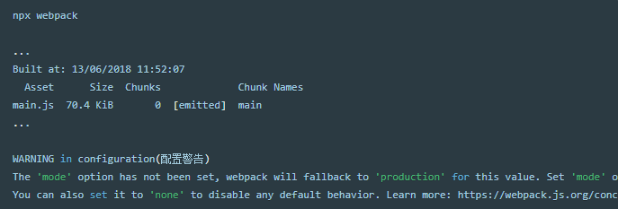

## 三、使用一个配置文件

在 webpack v4 中，可以无须任何配置，然而大多数项目会需要很复杂的设置，这就是为什么 webpack 仍然要支持 配置文件。这比在 terminal(终端) 中手动输入大量命令要高效的多，所以让我们创建一个配置文件：

### project

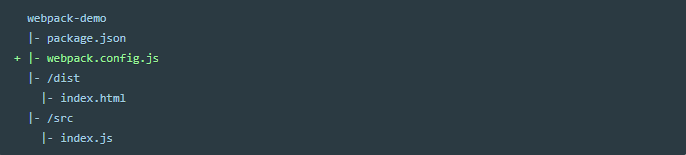

### webpack.config.js

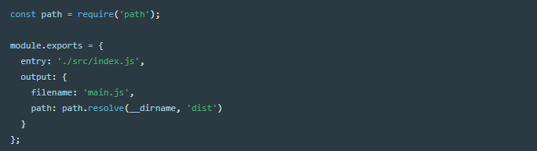

通过新的配置文件再次执行构建：

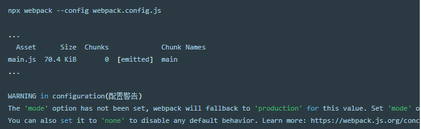

## 四、npm scripts

可以设置一个快捷方式。调整 package.json 文件，添加在 npm scripts 中添加一个 npm 命令：

### package.json

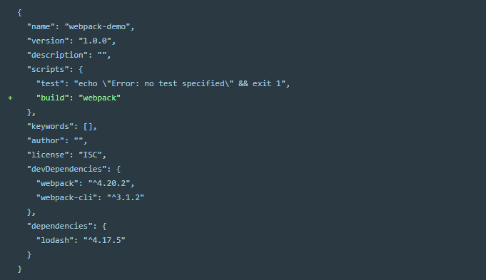

现在，可以使用 npm run build 命令，来替代我们之前使用的 npx 命令。注意，使用 npm scripts，我们可以像使用 npx 那样通过模块名引用本地安装的 npm packages。

运行以下命令，然后看看你的脚本别名是否正常运行：

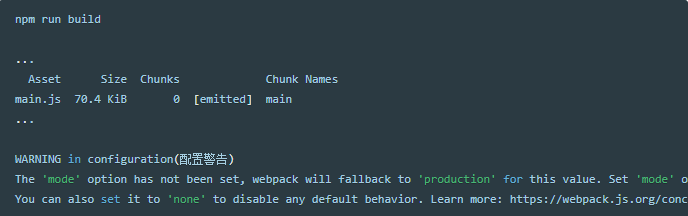

## 五、完成

现在有了一个基础构建配置

### project

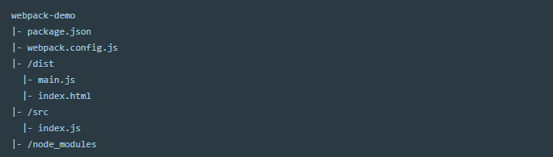